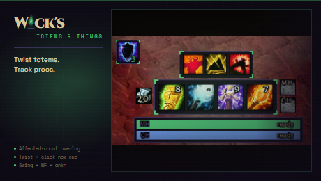

<p align="center"></p>

# Wick's Totems and Things

> Enhancement shaman command bar for TBC Classic. Totem twist on one keybind, swing timer, Windfury and Stormstrike proc flashes, range warnings, ankh count.

Part of the **[Wick suite](https://github.com/Wicksmods/WickSuite)**: precision TBC Classic addons with a shared fel-green-on-deep-purple aesthetic.

<!-- wick:suite-table:start -->
| Addon | GitHub | CurseForge |
|---|---|---|
| **Wick's TBC BIS Tracker** | [repo](https://github.com/Wicksmods/WickidsTBCBISTracker) | [CurseForge](https://www.curseforge.com/wow/addons/wicks-tbc-bis-tracker) |
| **Wick's CD Tracker** | [repo](https://github.com/Wicksmods/WicksCDTracker) | [CurseForge](https://www.curseforge.com/wow/addons/wicks-cd-tracker) |
| **Wick's Trade Hall** | [repo](https://github.com/Wicksmods/WicksTradeHall) | [CurseForge](https://www.curseforge.com/wow/addons/trade-hall) |
| **Wick's Macro Builder** | [repo](https://github.com/Wicksmods/WicksMacroBuilder) | [CurseForge](https://www.curseforge.com/wow/addons/wicks-macro-builder) |
| **Wick's Combat Log** | [repo](https://github.com/Wicksmods/WicksCombatLog) | [CurseForge](https://www.curseforge.com/wow/addons/wicks-combat-log) |
| **Wick's Stats** | [repo](https://github.com/Wicksmods/WicksStats) | [CurseForge](https://www.curseforge.com/wow/addons/wicks-stats) |
| **Wick's Quest Key** | [repo](https://github.com/Wicksmods/WicksQuestKey) | [CurseForge](https://www.curseforge.com/wow/addons/wicks-quest-key) |
| **Wick's Layers** | [repo](https://github.com/Wicksmods/WicksLayers) | [CurseForge](https://www.curseforge.com/wow/addons/wicks-layers) |
| **Wick's Totems and Things** | [repo](https://github.com/Wicksmods/WicksTotemsAndThings) | [CurseForge](https://www.curseforge.com/wow/addons/wicks-totems-and-things) |
<!-- wick:suite-table:end -->

## Features

- **Slim icon strip.** Four element buttons (Fire, Earth, Water, Air) on a draggable strip. Left-click casts the active preset's totem, right-click opens a totem picker. Keybind labels overlay each icon, action-bar style.
- **Affected count on every totem.** Each active totem shows how many party or raid members are inside its buff radius. Counts also overlay onto Blizzard's totem frame icons.
- **Out-of-range warning.** Step out of range of a buff totem you cast and the addon flashes a red banner, paints a screen-edge vignette, plays a single sound, and tints that element's icon border red. Walk back in and it clears instantly.
- **Totem twisting.** Toggle per-element twist from the Options panel. The icon flips to show the next totem to cast, a center countdown counts down to the refresh window, and a chime fires once when it's time to swap. Default air twist: Windfury <-> Grace of Air on a 5-second rhythm.
- **Cooldown / proc tracker.** A second slim bar tracks Reincarnation, Bloodlust / Heroism, Fire and Earth Elemental Totems, Nature's Swiftness, Elemental Mastery, Tidal Force, Mana Tide, Shamanistic Rage, Flurry stack, Windfury Weapon proc flash, and Stormstrike target debuff. Each entry auto-hides if your spec doesn't have the talent.
- **Swing timer.** Main-hand and off-hand bars surface in combat and fade out after. Off-hand bar hides when not dual-wielding.
- **Ankh reagent counter** anchored to the totem strip. Turns red when you're out of ankhs.
- **Editable presets.** Multiple named presets per character with inline rename, click-to-pick element totems, and a "+ New preset" button.
- **Wick chrome.** Dark-purple panels, fel-green L-bracket corners, two-tone "Wick's" title, slim 28px header, draggable positions.

## Install

- **CurseForge:** [curseforge.com/wow/addons/wicks-totems-and-things](https://www.curseforge.com/wow/addons/wicks-totems-and-things)
- **Manual:** download the latest ZIP from [Releases](https://github.com/Wicksmods/WicksTotemsAndThings/releases) and extract the `WicksTotemsAndThings` folder into `World of Warcraft\_classic_\Interface\AddOns\`.

## Usage

```
/wtt
```

Toggles the main panel. Bind keys via *Esc -> Key Bindings -> AddOns -> Wick's Totems and Things*.

| Command | Effect |
|---|---|
| `/wtt` | Toggle the main panel |
| `/wtt bar` | Toggle the slim totem icon strip |
| `/wtt cd` | Toggle the cooldown / proc bar |
| `/wtt swing` | Toggle the swing timer |
| `/wtt twist <element> on\|off` | Enable / disable totem twisting per element |
| `/wtt status` | Print bar diagnostic info |
| `/wtt range` | Print range-warning diagnostic + player buffs |
| `/wtt cdtest` | Print cooldown / proc tracker state |
| `/wtt resetbar` | Recover a lost icon strip |
| `/wtt resetcd` | Recover a lost cooldown bar |
| `/wtt resetswing` | Recover a lost swing timer |
| `/wtt resetpresets` | Wipe presets and re-seed defaults |
| `/wtt help` | Full slash command list |

## Compatibility

- TBC Classic Anniversary (2.5.5, Interface 20505)
- Pure Lua, no library dependencies
- Auto-hides shaman-only modules for non-shaman characters (panel still loads in viewer mode)

## Spec scope

v0.1 ships with the **Enhancement** toolkit dialed in: twist macro, swing timer, Windfury proc flash, Flurry stack, Stormstrike debuff. Resto and Elemental cooldown trackers are present but their headline UX (Mana Tide window cue, Lightning Overload, Earth Shield ICD) lands in v0.2.

## License

MIT for code (see [LICENSE](LICENSE)). Brand chrome and the "Wick's" wordmark are trademarked, see [TRADEMARK.md](https://github.com/Wicksmods/WickSuite/blob/main/TRADEMARK.md) in the Wick Suite repo.
