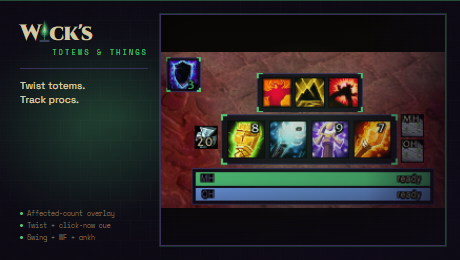

# Wick's Totems and Things

> Shaman loadout kit for World of Warcraft: Forever. Totem presets, secure cast bar, Call of the Elements sync, imbues, talents, pre-pull checklist, racials.

Part of the **[Wick suite](https://github.com/Wicksmods/WickSuite)**: precision addons built around a single fel-green-on-deep-purple aesthetic. This branch (`forever`) is the Forever build on [WickCore](https://github.com/Wicksmods/WickCore). The TBC Anniversary build lives on `main`.

<!-- wick:suite-table:start -->
| Addon | GitHub | CurseForge |
|---|---|---|
| **Wick's TBC BIS Tracker** | [repo](https://github.com/Wicksmods/WickidsTBCBISTracker) | [CurseForge](https://www.curseforge.com/wow/addons/wicks-tbc-bis-tracker) |
| **Wick's CD Tracker** | [repo](https://github.com/Wicksmods/WicksCDTracker) | [CurseForge](https://www.curseforge.com/wow/addons/wicks-cd-tracker) |
| **Wick's Trade Hall** | [repo](https://github.com/Wicksmods/WicksTradeHall) | [CurseForge](https://www.curseforge.com/wow/addons/trade-hall) |
| **Wick's Macro Builder** | [repo](https://github.com/Wicksmods/WicksMacroBuilder) | [CurseForge](https://www.curseforge.com/wow/addons/wicks-macro-builder) |
| **Wick's Combat Log** | [repo](https://github.com/Wicksmods/WicksCombatLog) | [CurseForge](https://www.curseforge.com/wow/addons/wicks-combat-log) |
| **Wick's Stats** | [repo](https://github.com/Wicksmods/WicksStats) | [CurseForge](https://www.curseforge.com/wow/addons/wicks-stats) |
| **Wick's Quest Key** | [repo](https://github.com/Wicksmods/WicksQuestKey) | [CurseForge](https://www.curseforge.com/wow/addons/wicks-quest-key) |
| **Wick's Totems and Things** | [repo](https://github.com/Wicksmods/WicksTotemsAndThings) | [CurseForge](https://www.curseforge.com/wow/addons/wicks-totems-and-things) |
| **Wick's Bags** | [repo](https://github.com/Wicksmods/WicksBags) | [CurseForge](https://www.curseforge.com/wow/addons/wicks-bags) |
| **Wick's Travel Form** | [repo](https://github.com/Wicksmods/WicksTravelForm) | [CurseForge](https://www.curseforge.com/wow/addons/wicks-travel-form) |
| **Wick's Ledger** | [repo](https://github.com/Wicksmods/WicksLedger) | [CurseForge](https://www.curseforge.com/wow/addons/wicks-ledger) |
| **Wick's Wardrobe** | [repo](https://github.com/Wicksmods/WicksWardrobe) | [CurseForge](https://www.curseforge.com/wow/addons/wicks-wardrobe) |

**Community:** [Discord](https://discord.gg/GWGTMhYBZY)
<!-- wick:suite-table:end -->

## What it is on Forever

Forever runs retail's engine with Midnight's addon rules. Totem state and the
player's own auras and cooldowns are secret in combat, and group auras are
unreadable. So the combat trackers from the TBC build are gone, and this is a
loadout kit: everything a shaman sets up before the pull.

- **Presets.** Named sets of four totems, one per element, with a drop order.
  Right-click any element button to change it. Cycle presets on a keybind.
- **Cast bar.** Four secure buttons that cast the active preset's totems, plus
  a drop-all keybind that runs them in sequence.
- **Call of the Elements.** The active preset is kept in Blizzard's four totem
  bar slots, and a keybind casts Call of the Elements to drop the whole set in
  one cast.
- **Twisting.** Two totems on one element button through a castsequence.
- **Imbues and ankhs.** Main hand and off hand imbue at a glance; ankh count.
- **Talents.** Export the active build as a Blizzard import string, import a
  string as a new loadout, save builds to an account-wide library, apply one
  with a click.
- **Pre-pull checklist.** Shield, both imbues, ankhs, preset complete. Rows
  go quiet the moment combat starts.
- **Racials.** Your race's actives as cast buttons with cooldown display.

## Install

Requires **[WickCore](https://github.com/Wicksmods/WickCore)**. Extract both
folders into the Forever client's `Interface\AddOns\`.

## Usage

| Command | Effect |
|---|---|
| `/wtt` | Main panel: Active, Presets, Bindings, Options |
| `/wtt kit` | Talents, checklist, racials |
| `/wtt bar` | Toggle the icon strip |
| `/wtt sync` | Push the active preset into Blizzard's totem bar |
| `/wtt twist <element> on|off` | Totem twisting |
| `/wtt order fire earth water air` | Drop order |
| `/wtt status` | Diagnostics |

Keybinds for the element buttons, drop-all, Call of the Elements, panel, bar
and preset cycling are under Key Bindings, AddOns.

## Compatibility

World of Warcraft: Forever, 1.60.x, Interface 16001. Requires WickCore.

## License

MIT for code (see [LICENSE](LICENSE)). Brand chrome and the "Wick's" wordmark are trademarked, see [TRADEMARK.md](https://github.com/Wicksmods/WickSuite/blob/main/TRADEMARK.md). Racial data from [talentsforever.com](https://talentsforever.com) (CC BY 4.0) via WickCore.
